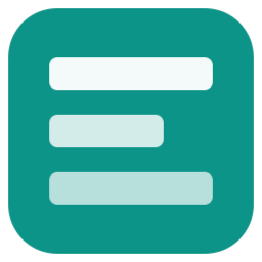

# go-widgets — brand assets

Official logos for the **go-widgets** organization.

## Formats

- **SVG** — `svg/color`, `svg/white` (white, transparent), `svg/black` (black, transparent)
- **PNG** 16→1024 px, 3 variants — `png/<variant>/<size>/`
- **JPG** (color, white background) — `jpg/<size>/`
- **ICO** (Windows) — `ico/`
- **ICNS** (macOS) — `icns/`
- **GitHub avatar** 512 px — `avatar/`
- **Social preview** 1280×640 (repo banner) — `social/`

---
*Auto-generated assets — rounded square badge, line glyph, color / white / black variants.*

## What CI checks

The marks are shown on somebody else's page, where a blank or mis-sized file
reads as a broken image and nothing here would say so. So every pull request
checks, with no image library installed: every avatar is 512×512 and large
enough not to be a failed render (the dimensions are read from the PNG header),
and every subject has the whole format matrix above.

## Use as a submodule

The [documentation site](https://github.com/go-widgets/docs) mounts these
marks from a **release tag** of this repository, not from `main`: a mark
changes on the site when somebody moves the submodule, not when somebody pushes
here.

## Licence

The marks are the organisation's own work, released under BSD-3-Clause
([LICENSE](LICENSE)) with the code they brand.
